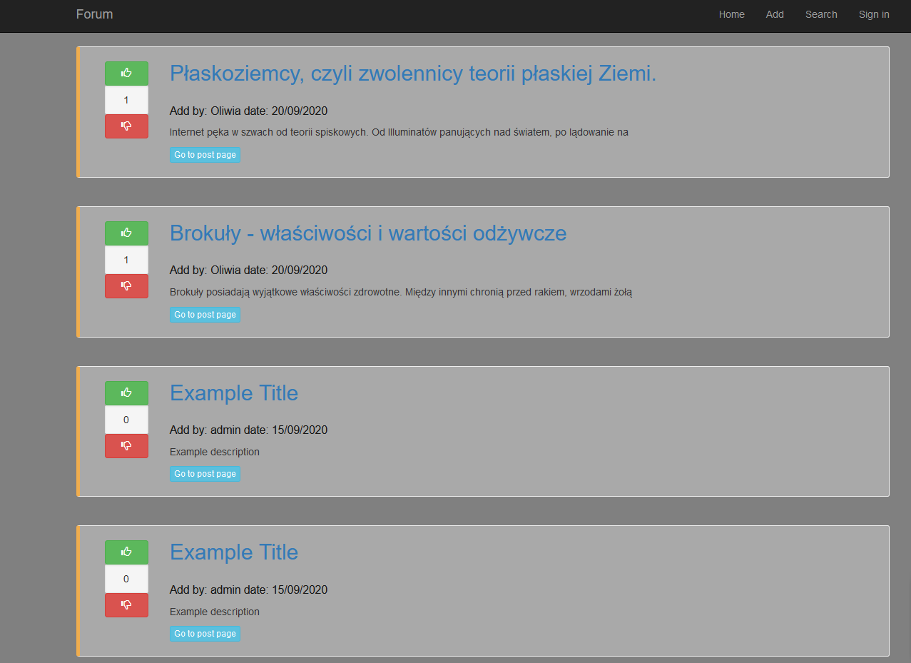
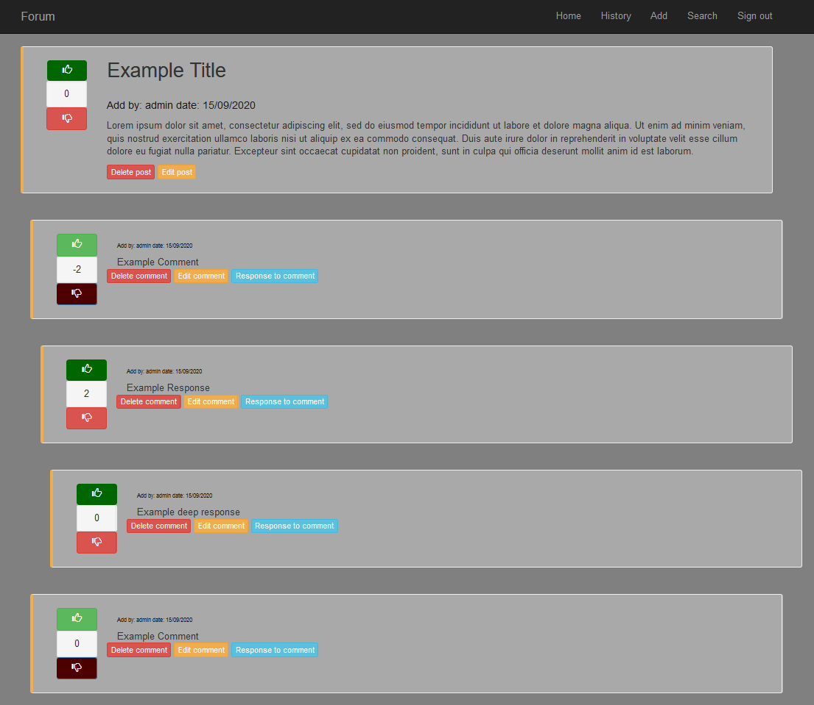
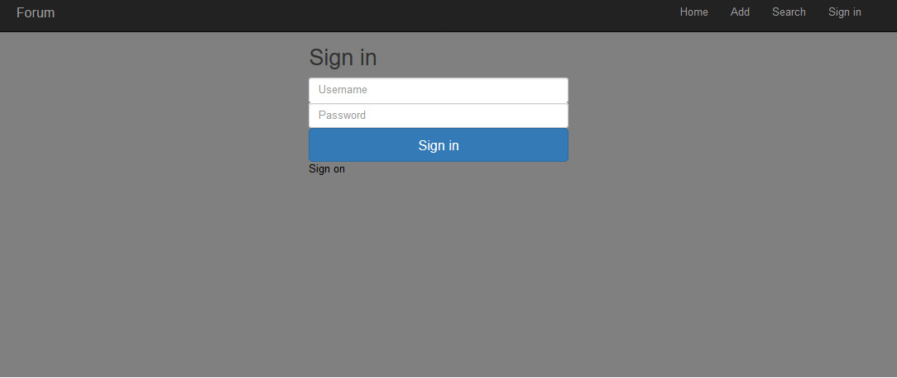

# Forum

> This is my first fully functional java web aplication. This forum can be used like a template for some dynamic build website like car's blog or something like facebook.

## Table of contents
* [General info](#general-info)
* [Screenshots](#screenshots)
* [Technologies](#technologies)
* [Setup](#setup)
* [Status](#status)
* [Contact](#contact)

## General info
This forum is my first java web aplication. It shows dynamic generate pages with post, comments and votes added by users. One of the core things is working with database.
You can:
- sign on/in/out (using SHA256 for secure password)
- add/edit/delete posts
- add/edit/delete comments
- vote for post/comment
- search posts
- check your history

You can easly transform this template for some specific topic forum like car's or music forum

## Screenshots




## Technologies
* Java 
* Java ee 
* Maven 
* Bootstrap
* MySQL
* Tomcat server 
* Expression Language
* JSTL
* Spring JDBC
* Jsp pages 
* Html
* Css


## Setup
To use this aplication local you have to install:
- Tomcat 9
- java ee
- Mysql

First you must created database from code in dbscript - this code is generated by workbench.
Than you need to make this query (you can use workbench in windows):
```sql
INSERT INTO role VALUES(user);
INSERT INTO role VALUES(admin);
```
Than you need to add contet.xml to webapp\META-INF folder changing username,password and db url for youre local and its all done.

## Status
You can try this aplicat online using forum.mazurkiewicz.me link 

## Contact
Created by Dawid Dudek - feel free to contact me!